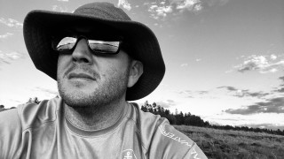

+++
title = "Code 2 Cloud - About"
description = "Everything you wanted or didn't want to know about me"
author = "Jason Parker"
date = "2020-11-25T14:01:23-07:00"
tags = ["Personal"]
categories = ["Personal"]
comments = false
removeBlur = false
[[images]]
  src = "img/main/big_lake_az.jpeg"
  alt = "Big Lake AZ"
  stretch = ""
draft = "true"
+++

# About Jason

I am a Sr. Consultant working for [Microsoft](www.microsoft.com), specializing in Azure Adoption and Automation and a subject matter expert in Azure, Office 365, Exchange and PowerShell authoring as well as in the dependency areas such as Windows Server, Active Directory, network services, high availability, clustering, load balancing, disaster recovery, code review and script creation.  These skill sets have been focused in local, state, and federal agencies, but not limited to these areas.

Since 1998, I have worked in a wide variety of Information Technology roles and industries.  I joined Microsoft in January 2012 with a primary focus on Exchange, Office 365 and Active Directory where I successfully led many customers through architecture design, deployment, and migration of their messaging and identity platforms.  Today, I continue to support a large federal agency in their adoption of Windows Virtual Desktop and all thing Azure.

## Personal facts

Proud to be born and raise in Arizona. Married to my best friend and the woman of my dreams for over 20 years.  We have two (2) beautiful daughters who bring me great joy! I love Jesus and everyday try and become a better man than the day before.

### What I like

Proud to be born and raise in Arizona. I love to scuba dive, play video games (Xbox and PC), spend time outdoors (hiking / camping), enjoying watching movies and TV shows and I enjoy Bourbon! I drink my coffee **BLACK** and most people consider me to be a huge nerd (go figure)

### How I work

- I am **passionate** about my work and love to **teach** others
- I value **authentic** and **transparent** relationship
- I am a **blunt** and **straight-forward** communicator
- I work best **under pressure** or under tight timelines
- I don't do anything *half-way*, whem I am **IN**, I am **ALL IN**

### Personal Philosophies

- **DFTBA** - Don't Forget To Be Awesome
- We can’t solve the problems of today, using the same think from when we created them – “Albert Einstein”
- Don’t forget the little things, details matter…
- Be honest and have fun
- Don’t forget to smile, its contagious

